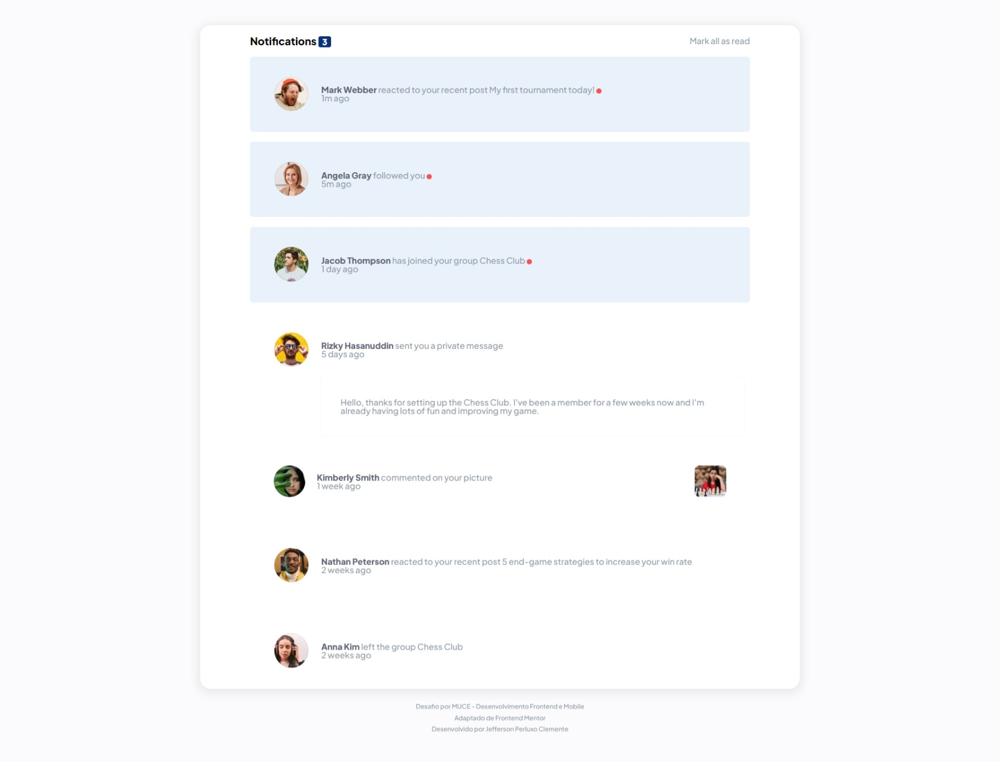
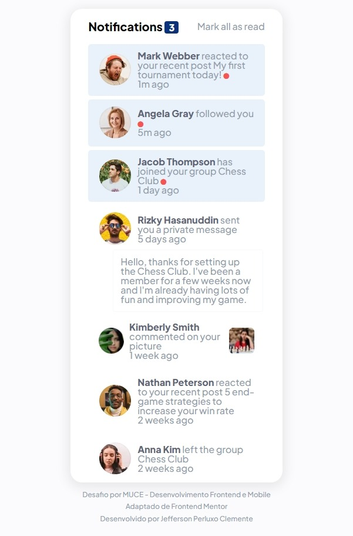

# Solução do Desafio - Página de Notificações

## Overview

### Requisitos do Desafio
Os usuários devem ser capazes de:
- Distinguir entre notificações "não lidas" e "lidas”;
- Marcar tudo como lido, alternando o estado visual das notificações não lidas e atualizando o número de mensagens não lidas para zero;
- Utilizar a interface independentemente do tamanho do seu dispositivo (a interface deve ser responsiva para que isso seja possível);
- Ver claramente a diferença dos estados e/ou eventos de “hover” e “focus” para todos os elementos interativos na página.

### Screenshots

### Links
- [*URL da solução*](https://jperluxo.github.io/desafio-pagina-notificacoes-resolvido)

### Tecnologias utilizadas
- HTML5 Semântico
- Propriedades personalizadas do CSS
- Flexbox
- _Media Queries_
- Javascript

### Continuação do desenvolvimento
O ideal para esse projeto seria o uso de <code>Grid</code>, seria interessante também a aplicação da metodologia de <code>Atomic Design</code>, assim tirando toda a responsabilidade do projeto de apenas um único arquivo <code>.css</code>.

